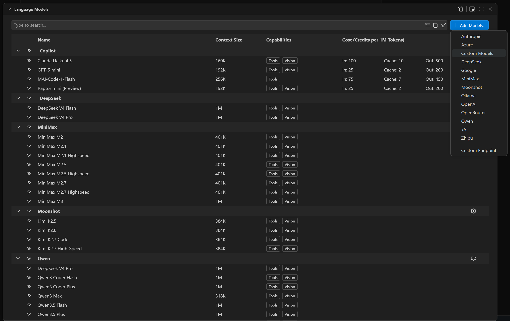
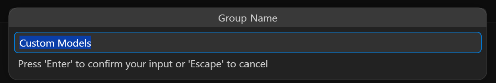
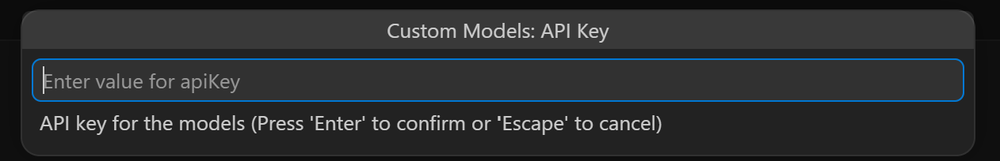
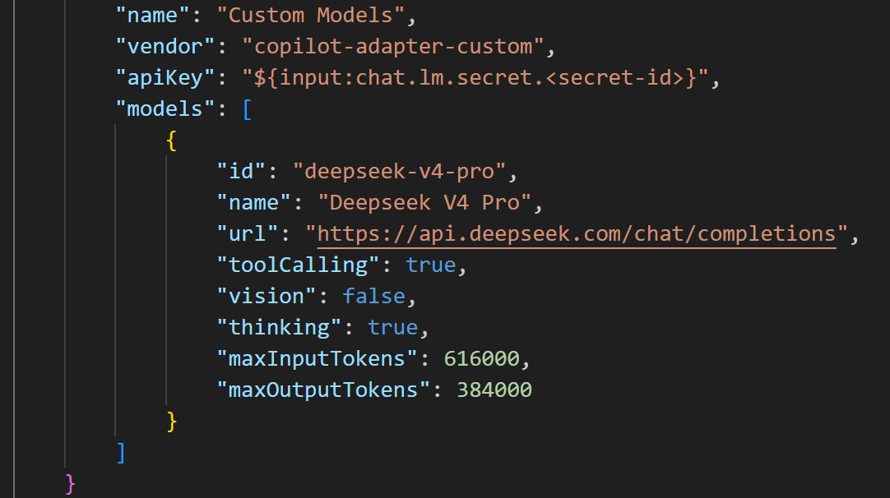
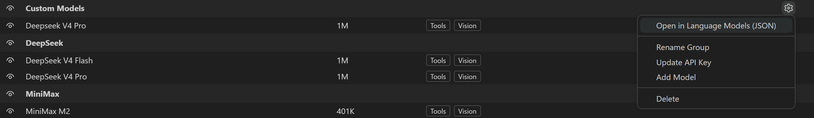

# How to Add a Custom Model

The **Custom Models** provider lets you bring any OpenAI-compatible model into Copilot Chat.
You define model metadata (name, endpoint, capabilities, token limits) directly in the
configuration file — no coding required.

---

## Step 1  Open the Language Models panel

Open the model management panel, or press `Ctrl/Cmd+Shift+P` and type *Language Models*.
Click **+ Add Model…** in the top-right corner and choose **Custom Models** from the dropdown.

---

## Step 2  Enter a group name and API Key

A dialog will prompt you for a **Group Name** (defaults to "Custom Models") and your **API Key**.
The key is stored exclusively in VS Code Secret Storage and never written to disk.

---

## Step 3  Configure your models in the `models` array

The JSON file opens at the correct position.  Add one or more model objects to the
`"models"` array.  Each model requires at minimum `id`, `name`, `url`, `toolCalling`,
`vision`, `maxInputTokens`, and `maxOutputTokens`.

For thinking models (`"thinking": true`), the `"supportsReasoningEffort"` field is
**optional** — when omitted, the extension auto-selects the correct pre-built config
based on the model `id`.  Fill it in only if you need to customize the options,
labels, or request body shape.

---

### `models` Field Reference

| Field | Type | Required | Description |
|---|---|---|---|
| `id` | `string` | Yes | Unique model identifier; also sent as the `model` value in API requests |
| `name` | `string` | Yes | Display name shown in the model picker |
| `url` | `string` | Yes | API endpoint URL, must start with `http://` or `https://` |
| `toolCalling` | `boolean` | Yes | Whether the model supports tool calling (Function Calling) |
| `vision` | `boolean` | Yes | Whether the model supports image input. Set to `false` if the model does not support images, otherwise the vision proxy from other multimodal models cannot be applied |
| `maxInputTokens` | `number` | Yes | Maximum input tokens the model accepts |
| `maxOutputTokens` | `number` | Yes | Maximum output tokens the model generates |
| `thinking` | `boolean` | No | Whether the model supports thinking/reasoning, default `false`. When `true` and `supportsReasoningEffort` is unset, a pre-built config is auto-matched by model `id` |
| `thinkingTag` | `string` | No | Tag used to parse thinking content from streaming responses (e.g. `<think>` for MiniMax) |
| `supportsReasoningEffort` | `string[]` or `object` | No | Thinking effort options. Array form (e.g. `["low", "high"]`) auto-generates request fields; object form gives precise control over `requestFields`, `label`, `hint` per option |
| `maxTools` | `number` | No | Maximum tools per request, defaults to `128` (`toolCalling: true`) or auto-disabled (`toolCalling: false`) |

> **Tip:** See [`custom-models-template.jsonc`](../docs/custom-models-template.jsonc) for ready-to-copy
> model templates covering DeepSeek, OpenAI, Anthropic, Qwen, Zhipu, MiniMax, Gemini, Grok, and more.

---

## Step 4  Your custom models appear in the model picker

Save the file.  Open the Copilot Chat model picker — your custom models now appear
under the **Custom Models** group.  Select one and start chatting.

---

## Step 5  Add or edit models in the current group

In the model management list, find the Custom Models group you just added and click the
gear icon on the right.  Select **Open JSON in Language Models** to add or edit models
directly in the `models` array.

