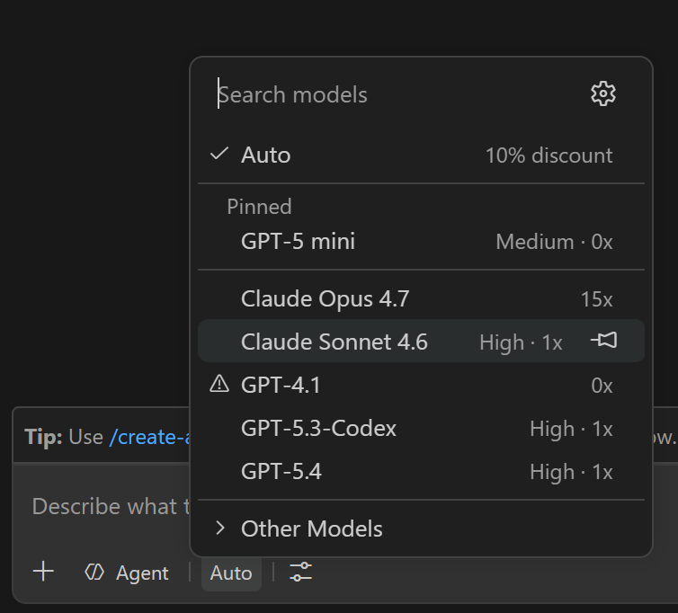
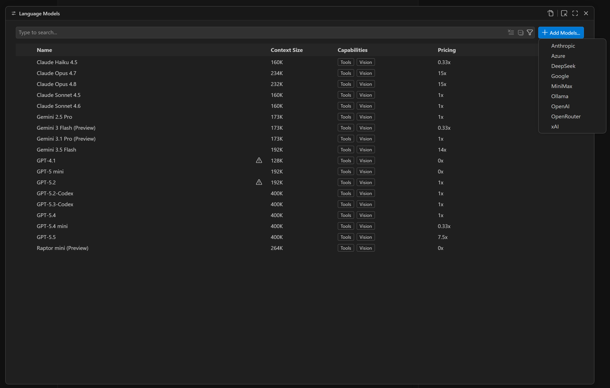
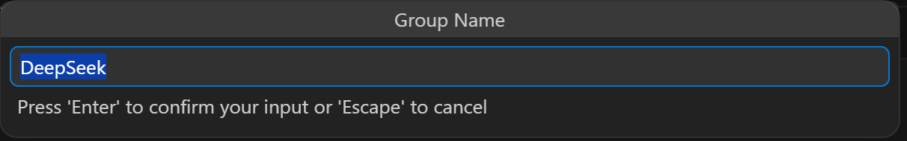
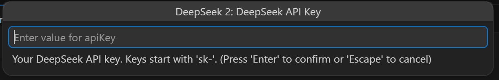
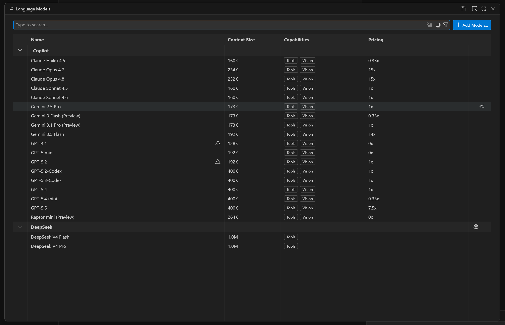
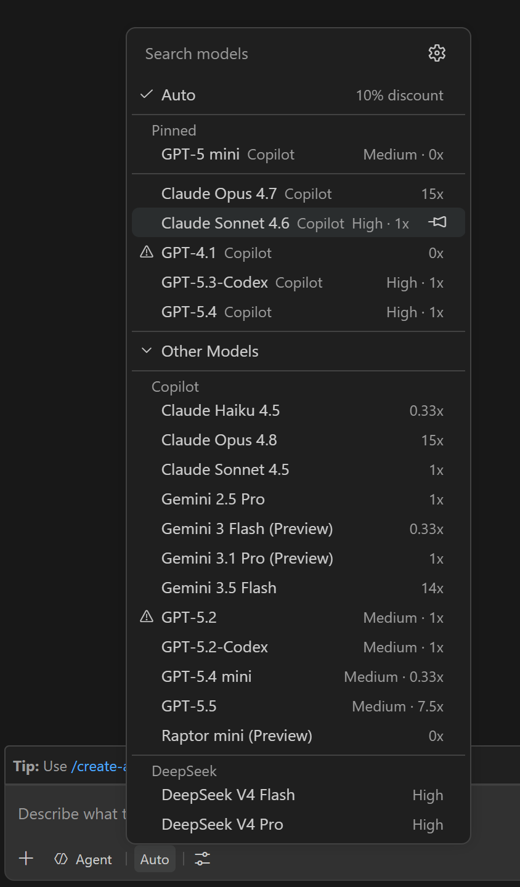

# How to Add a Model Provider

This guide walks through adding a provider (using DeepSeek as an example) via the VS Code **Language Models** panel the native, recommended approach.

---

## Step 1 Open the model selector in Copilot Chat

Click the model selector at the bottom of the Copilot Chat input. You'll see the currently available models. DeepSeek and MiniMax are not listed yet.

---

## Step 2 Open the Language Models panel and click "+ Add Models..."

Open the **Language Models** panel (or `Ctrl/Cmd+Shift+P` *Language Models*), then click **+ Add Models...** in the top-right corner. After installing the extension, the dropdown will include all providers it supports select the one you need.

---

## Step 3 Confirm the group name

A prompt asks for a group name. The default is the provider name, but you can enter any name you like as long as it doesn't conflict with an existing group. Press **Enter** to confirm.

---

## Step 4 Enter API Endpoint and API Key

If a provider supports multiple endpoints, select or enter the endpoint first, as shown below.

Then enter your API key (starts with `sk-`) and press **Enter**. The key is stored in VS Code's Secret Storage immediately it is never written to disk or settings files.

> Tip: You can add multiple groups for the same provider. Make sure each group uses a different **Group Name** and a different **API Key**.

---

## Step 5 Provider appears in the Language Models panel

The Language Models panel now shows the DeepSeek group with both models listed. Click the ⚙ icon next to the group name to change the API key or adjust settings at any time.

---

## Step 6 Models are available in Copilot Chat

Open the model selector in Copilot Chat again. DeepSeek V4 Flash and DeepSeek V4 Pro now appear under **Other Models**. Select one to start chatting.

