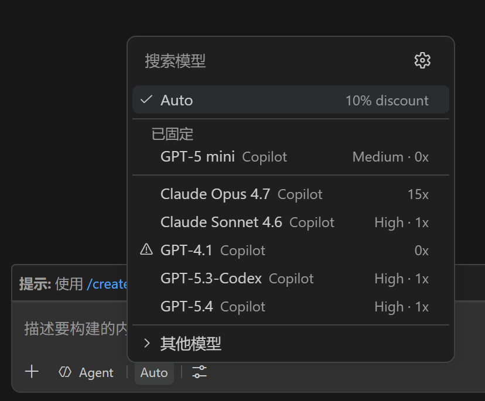
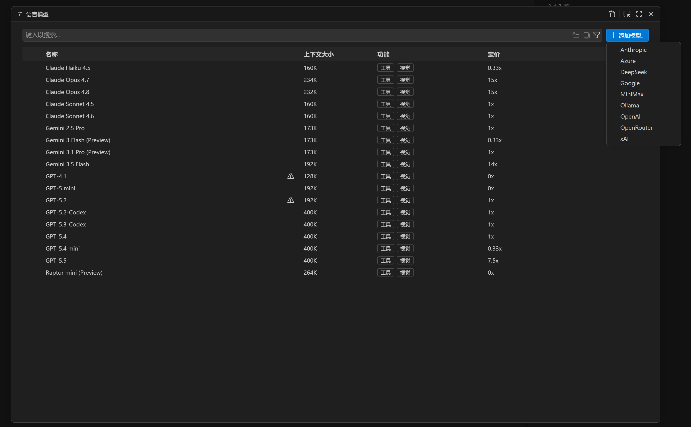
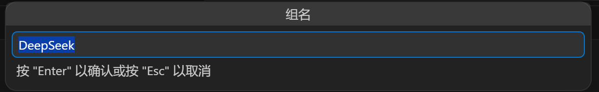
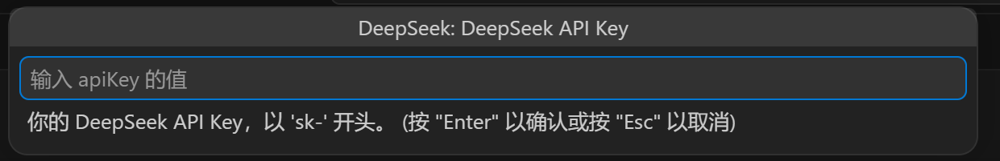
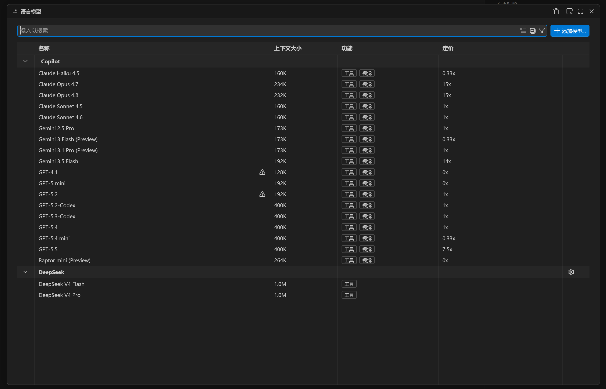
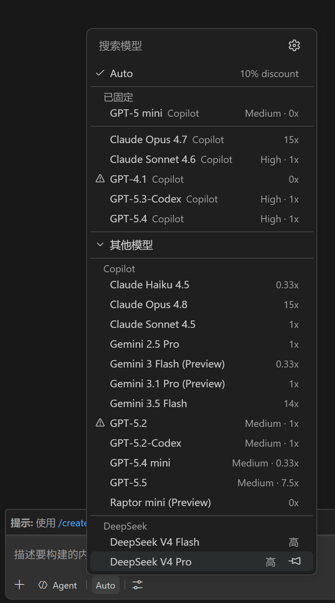

# 如何添加模型提供商

本文以 DeepSeek 为例，演示通过 VS Code **语言模型**面板添加提供商的完整流程——这是官方推荐的原生方式。

---

## 第 1 步 — 打开 Copilot Chat 的模型选择器

点击 Copilot Chat 输入框底部的模型选择器，可以看到当前可用的模型列表。此时 DeepSeek 和 MiniMax 尚未出现。

---

## 第 2 步 — 打开语言模型面板，点击"添加模型..."

通过 `Ctrl/Cmd+Shift+P` → *语言模型* 打开**语言模型**面板，点击右上角的 **+ 添加模型...**，在下拉列表中选择 **DeepSeek**（或 **MiniMax**）。

---

## 第 3 步 — 确认分组名称

弹出输入框要求填写分组名称。默认已填入提供商名称，你也可以输入任意喜欢的名字，只要不与已有分组重复即可。确认后按 **Enter**。

---

## 第 4 步 — 输入 API Key

输入以 `sk-` 开头的 API Key 并按 **Enter**。Key 会立即存入 VS Code Secret Storage，不会写入磁盘或任何配置文件。

获取 API Key：
- DeepSeek：[platform.deepseek.com/api_keys](https://platform.deepseek.com/api_keys)
- MiniMax：[minimax.io — 接口密钥](https://www.minimax.io/platform/user-center/basic-information/interface-key)

---

## 第 5 步 — 提供商出现在语言模型面板中

语言模型面板中现在显示 DeepSeek 分组，其下列出了两个模型。随时可点击分组名称旁的 ⚙ 图标修改 API Key 或调整配置。

---

## 第 6 步 — 在 Copilot Chat 中使用模型

再次打开 Copilot Chat 的模型选择器，DeepSeek V4 Flash 和 DeepSeek V4 Pro 已出现在**其他模型**分组下。选择其中一个即可开始对话。

